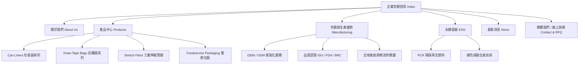

# 塑膠包裝與薄膜外銷製造企業網站架構規劃方案

本方案針對**塑膠袋、垃圾袋、拉繩袋及薄膜（Stretch Film / Scale Sheet）外銷製造企業**，量身打造符合國際 B2B 買家期待的大型企業官網架構。

---

## 1. 國際大廠級企業網站架構藍圖 (Information Architecture)

大企業網站需具備**品牌信任感、產品專業度、國際合規性（ESG/認證）與快速轉化（RFQ）**四大核心。網站導覽與頁面層級規劃如下：

---

## 2. 核心頁面與區塊詳細規劃 (Page Breakdown)

### 2.1 導覽列 (Header & Navigation)
- **品牌 Logo**：雙語企業識別標誌（Inteplast）。
- **主選單 (Navigation Menu)**：關於我們、產品系列、製造優勢、永續 ESG、線上詢價。
- **語系切換 (Language Switcher)**：繁體中文 / English（針對外銷買家，預設或利於切換至英文）。
- **快速詢價按鈕 (RFQ CTA Button)**：「Get a Quote / 聯繫詢價」醒目膠囊按鈕。

### 2.2 首頁 (Home Page - 高視覺體驗與滾動動畫)
1. **Hero Section (視覺焦點)**：高畫質大圖/影片搭配 GSAP 滾動動畫，呈現先進自動化包裝與薄膜生產線，並帶出品牌願景（例如："Premium Packaging & Industrial Film Solutions for Global Markets"）。
2. **Key Capabilities (企業三大優勢數據標竿)**：
   - 每日/年產能 (Production Capacity)
   - 全球外銷國家數 (Global Export Reach)
   - 國際品質認證標章 (ISO 9001 / FDA / BRCGS)
3. **Core Product Showcases (四大核心產品滾動展示區)**：
   - **Can Liners & Trash Bags**：商業/工業用高品質垃圾袋。
   - **Draw-Tape Bags**：高強度自動拉繩袋（韌性強、易封口）。
   - **Stretch Films & Sheeting**：工業包裝膜、機器膜、手打膜與客製化薄膜。
   - **Foodservice Packaging**：食品級衛生包裝與容器膜。
4. **Global Manufacturing & OEM Service (外銷製造實力)**：展現強大的客製化厚度、尺寸、顏色與印刷能力，專為國際品牌與通路商提供 OEM/ODM 服務。
5. **Sustainability & Innovation (ESG 永續承諾)**：展示 PCR (Post-Consumer Recycled) 再生塑料應用與減碳包裝成果，符合美歐環保法規需求。
6. **Customer RFQ & Contact Footer (轉化區塊)**：簡潔專業的快速詢價入口與聯絡資訊。

### 2.3 產品中心 (Product Catalog System)
- **產品分類切換 (Category Tabs)**：分類清晰，買家可快速點選切換（Can Liners / Draw-Tape / Stretch Films / Foodservice）。
- **規格與特點對照 (Specifications Table)**：
  - 材質 (Material: HDPE / LDPE / LLDPE / PCR)
  - 尺寸與厚度範圍 (Gauge / Micron / Size)
  - 封口類型 (Star Seal / Flat Seal / Drawstring)
  - 包裝方式 (Roll / Coreless / Interfold)
- **高清產品圖與應用場景 (High-res Product Gallery)**。

### 2.4 線上詢價與聯繫我們 (Contact & RFQ)
- **B2B 表單設計**：
  - 採購產品類別勾選 (Product Interests)
  - 預計採購量 (Estimated Quantity)
  - 客製化規格需求 (Thickness / Size / Material)
  - 公司資訊與外銷交貨地點 (Company Name, Country, Port of Destination)

---

## 3. 大企業網站不可或缺的專業細節 (Best Practices for Large Enterprises)

1. **極致視覺與滾動動畫 (GSAP ScrollTrigger)**：
   - 滾動流暢自然，漸顯（Fade-in）、滾動卡片懸停（Hover effect），展現科技感與國際現代大廠風範。
2. **針對國際買家優化的 SEO 與 速度 (International SEO & Performance)**：
   - 結構化標籤（Schema.org Organization & Product）。
   - 響應式切換（Mobile/Tablet/Desktop 完美自適應）。
   - 圖片懶加載與高壓圖檔（WebP/SVG），確保歐美買家開網頁迅速無卡頓。
3. **建立國際採購信任感 (Trust Elements)**：
   - ISO/FDA 認證證書展示。
   - 工廠自動化設備與品質檢測流程介紹。
   - 永續與綠色材料標準合規聲明。

---

## 4. 預計實作步驟 (Proposed Changes for Workspace)

#### [MODIFY] [index.html](file:///c:/Users/lyanc/VScodeProgram/inteplast_home_page_tw/index.html)
- 導入升級版網站結構：包含雙語導覽、滾動動畫 Hero 區、四大產品線（垃圾袋、拉繩袋、薄膜、食品包裝）展示卡片、外銷與製造優勢區塊、ESG 永續區塊以及 RFQ 詢價表單。

#### [NEW] [style.css](file:///c:/Users/lyanc/VScodeProgram/inteplast_home_page_tw/style.css) *(可選與重構)*
- 整理專業的顏色系統（高雅深藍 `#0A2540` / 環保綠 / 科技白）與現代字體，增強動態 hover 與微動畫效果。

---

## 5. 驗證計劃 (Verification Plan)

### 手動驗證
1. 使用瀏覽器開啟 `index.html`，檢查 GSAP 滾動動畫流暢度與響應式切換。
2. 確認產品區塊包含垃圾袋、拉繩袋、薄膜（Stretch Films）等關鍵產品與規格。
3. 測試聯絡表單/線上詢價 UI 的視覺與輸入體驗。
